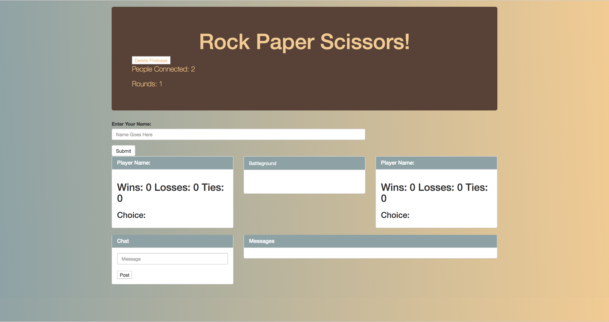

# Firebase Rock Paper Scissors

Used Firebase to make a rock paper scissors game. The data that persists in firebase includes the number of instances of the app running (as connections), each player's name/scores/choice, and messages.

## Getting Started

Hosted on [GitHub pages](https://unobtainiumrock.github.io/firebase-rps/).

## Built With

* [Bootstrap](https://getbootstrap.com/docs/4.0/getting-started/introduction/)
* [JQuery](http://jquery.com/)
* [Javascript](https://eloquentjavascript.net/)
* [CSS](https://css-tricks.com/)
* [HTML](https://developer.mozilla.org/en-US/docs/Web/HTML)
* [Firebase](https://console.firebase.google.com/) 

## Authors

* **Unobtainiumrock**

## License

This project is licensed under the MIT License - see the [LICENSE.md](LICENSE.md) file for details

## Acknowledgments

* Pineapple goes well on pizza
* Cats
* Trees
* Unobtainiumrock Industries ®

